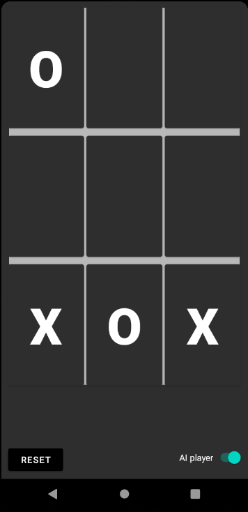

<p align="center">
    
</p>

# ❌⭕ TicTacToeApp 

[](https://github.com/MartinKondor/TicTacToeApp) [](https://github.com/MartinKondor/TicTacToeApp)  [](https://github.com/MartinKondor/TicTacToeApp/issues)

TicTacToe game with primitive AI for Android

## Features

* Play against AI
* Play with an other human on one screen

## Contributing

Ways to contribute:

* Check for open issues
* Read the ```TODO``` file
* Make an improvement

### Steps

1. Fork this repository
2. Create a new branch (optional)
3. Clone it
4. Make your changes
5. Upload them
6. Make a pull request here

## Authors

* **[Martin Kondor](https://github.com/MartinKondor)**

<p align="center">
<a title="Fiverr" href="https://www.fiverr.com/martinkondor">

</a>
</p>

<p align="center"><a href="https://www.patreon.com/bePatron?u=17006186" data-patreon-widget-type="become-patron-button"></a></p>

## License

Copyright &copy; Martin Kondor 2021.

MIT license, see the [LICENSE](./LICENSE) file for more details.
